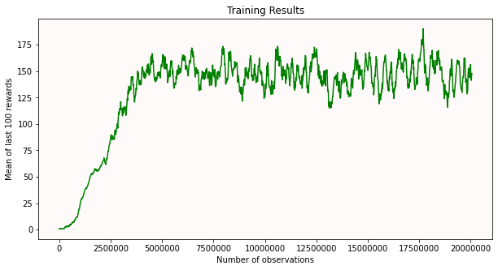
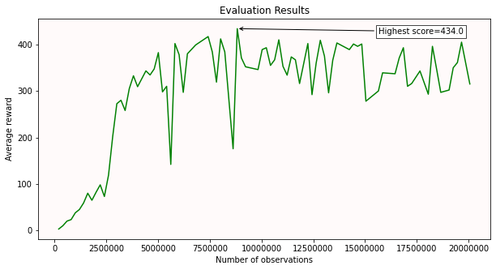
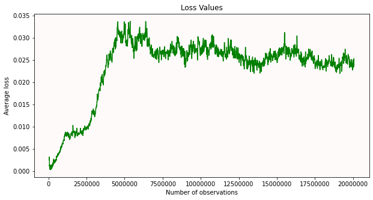

# Using Deep Q-Learning to win Breakout

Simple and efficient way to win Breakout using Deep Q-Learning.

I didn't include the weights of the winning rounds because I generated too many weights and lost track. But within 16 hours of training, you should be able to get them by yourself.

## Evaluation Results

## Setup
- Python 3.8.10
- NVidia GPU (GTX 1060, RTX 3060)
- Ubuntu 20.04 & Windows

## Installation
`pip install -r requirements.txt`

## Launching
Run `jupyter-notebook` in your terminal. Then select `main.ipynb` and start running the blocks from top to bottom. You should visually see the output.
